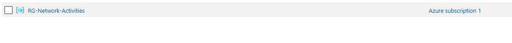
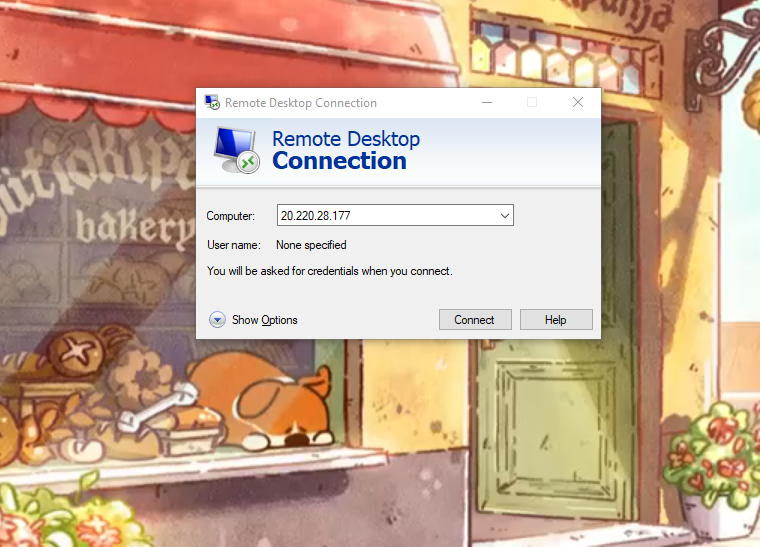
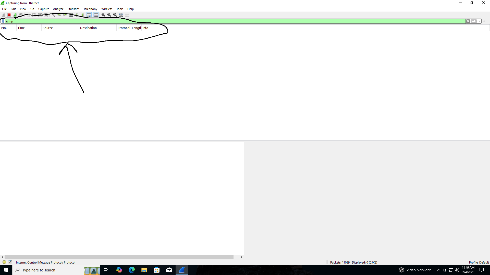
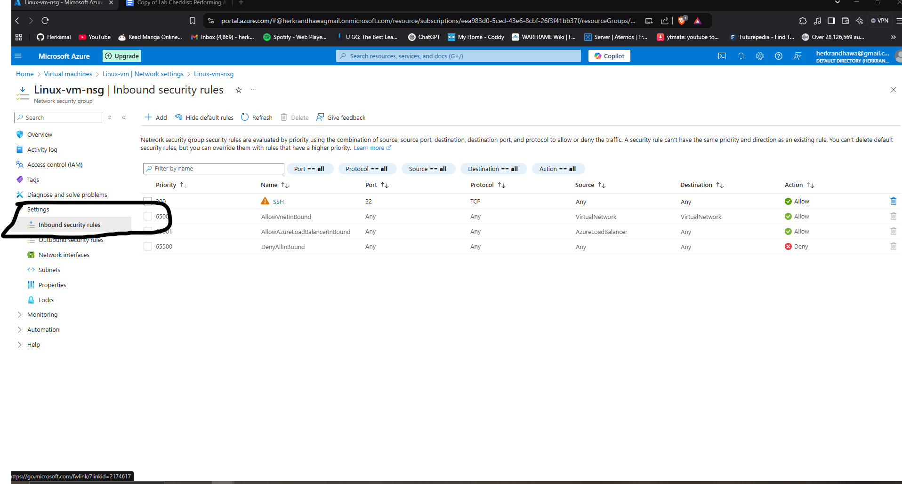
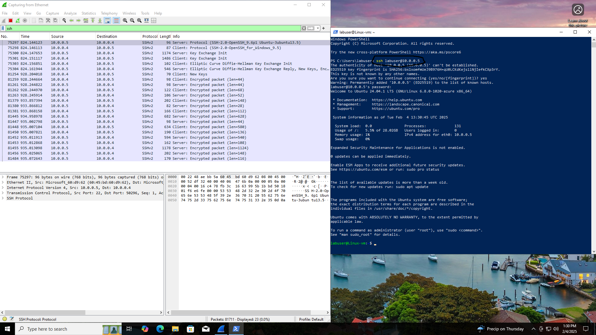
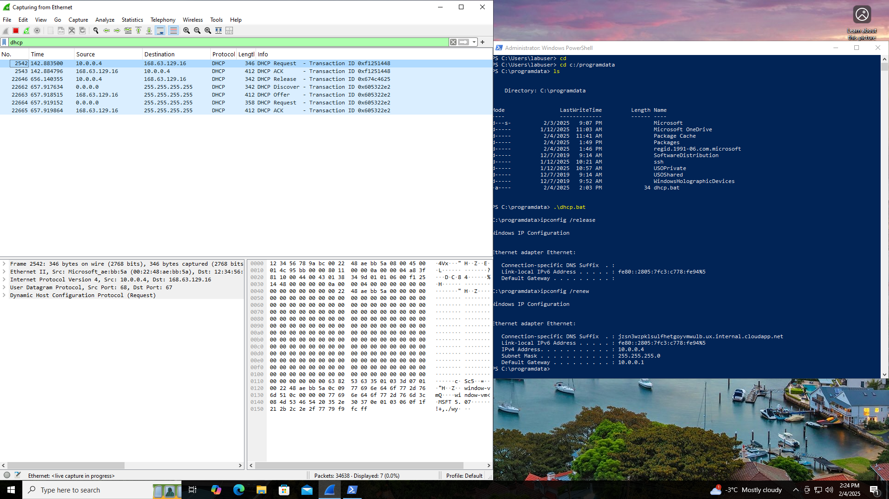
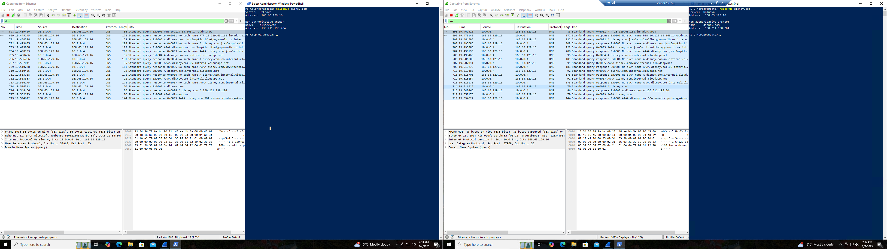
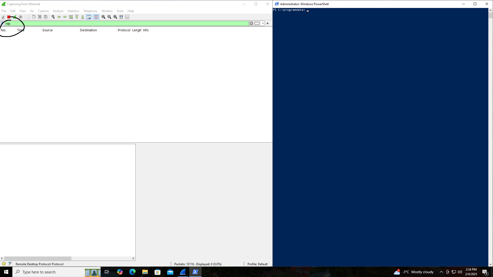

# Azure Networking & Packet Analysis with Wireshark

This lab demonstrates how to deploy virtual machines in Microsoft Azure, capture and analyze network traffic with Wireshark, configure firewall rules using Network Security Groups (NSGs), and observe traffic for ICMP, SSH, DHCP, DNS, and RDP protocols.

---

## 🧰 Technologies Used

- Microsoft Azure (Resource Groups, Virtual Machines, Networking)
- Windows 10 Pro (Windows-VM)
- Ubuntu Linux (linux-vm)
- Wireshark
- Remote Desktop Protocol (RDP)
- PowerShell
- Network Security Groups (NSG)

---

## 🎯 Objectives

- Deploy and connect multiple VMs in Azure  
- Capture and analyze ICMP, SSH, DHCP, DNS, and RDP traffic  
- Configure and test firewall rules with NSGs  
- Understand how protocol traffic appears in packet captures  
- Practice network troubleshooting skills  

---

## 🖥️ Step-by-Step Lab

### ☁️ Step 1: Create Azure Resources

  

On **Azure Portal**:

1. Create a **Resource Group**.  
2. Create a **Windows 10 VM** in the same Resource Group.  
3. Allow Azure to create a **new Virtual Network (Vnet)** and **Subnet**.  
4. Create a **Linux (Ubuntu) VM** in the same Resource Group and **same Vnet/Subnet**.  
5. Use **Username/Password** authentication.  

---

### 🔌 Step 2: Connect to Windows VM & Install Wireshark

  

1. Connect to the Windows 10 VM via **Remote Desktop**.  
2. Download and install **Wireshark**.  
3. Start a packet capture.  

---

### 📡 Step 3: Observe ICMP Traffic

  

1. In Wireshark, filter for **ICMP** traffic.  
2. Retrieve the **private IP** of the Ubuntu VM.  
3. Ping the Ubuntu VM from Windows-VM and observe ICMP request/reply packets.  
4. Ping a public website (e.g., `google.com`) and observe traffic in Wireshark.  

---

### 🔒 Step 4: Configure Firewall Rules (NSG)

  

1. Start a **continuous ping** from Windows-VM to Ubuntu VM.  
2. In the Ubuntu VM’s **Network Security Group**, disable inbound ICMP traffic.  
3. Observe ping failure in Command Prompt and Wireshark.  
4. Re-enable inbound ICMP traffic and confirm pings resume.  

---

### 🔑 Step 5: Observe SSH Traffic

  

1. In Wireshark, filter for **SSH** traffic.  
2. From Windows-VM, open PowerShell and run:  
   `ssh labuser@<private IP>`  
3. Enter credentials and run commands.  
4. Observe encrypted SSH packets in Wireshark.  

---

### 🌐 Step 6: Observe DHCP Traffic

  

1. Filter Wireshark for **DHCP** traffic.  
2. From PowerShell (Admin), run:  
   `ipconfig /renew`  
3. Observe DHCP request and acknowledgment packets in Wireshark.  

---

### 🌍 Step 7: Observe DNS Traffic

  

1. Filter Wireshark for **DNS** traffic.  
2. From Command Prompt, run:  
   `nslookup google.com`  
   `nslookup disney.com`  
3. Observe DNS queries and responses in Wireshark.  

---

### 🖥️ Step 8: Observe RDP Traffic

  

1. Filter Wireshark for **RDP** (`tcp.port == 3389`).  
2. Observe continuous packet activity — RDP streams a live desktop session, so traffic is constant.  

---

## 🧹 Lab Cleanup

1. Close the RDP session.  
2. Delete the Resource Group to remove all resources.  

---

## ✅ Summary

In this lab, we successfully:

- Created and connected Windows & Linux VMs in Azure  
- Captured and analyzed multiple network protocols  
- Configured and tested firewall rules with NSGs  
- Observed real-time network behavior with Wireshark  

This project highlights hands-on skills in Azure administration, network monitoring, and protocol analysis.

